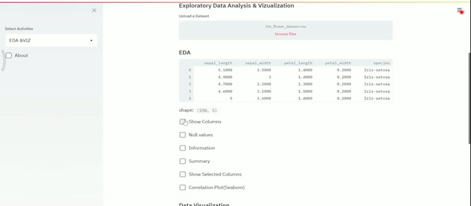
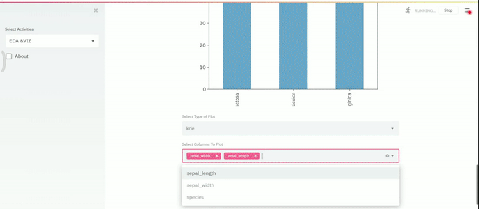

Streamlit’s open-source app framework is the easiest way for data scientists and machine learning engineers to create beautiful, performant apps in only a few hours!  All in pure Python. All for free.

## Description
This applications helps in doing EDA , plotting  without any code written explicitly , just by uploading the dataset(csv only as of now) selecting the options .
It preprocess the data , Trains and saves classification problems and provides option to download the saved model as pickle file . 

## Dependancies

pip install -r requirements.txt

## Run
streamlit run dobby.py
